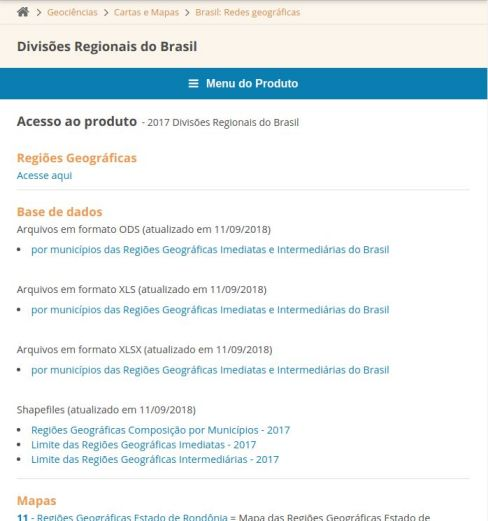
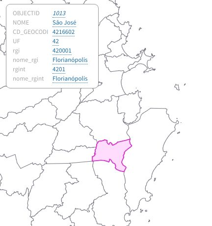
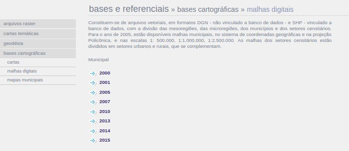
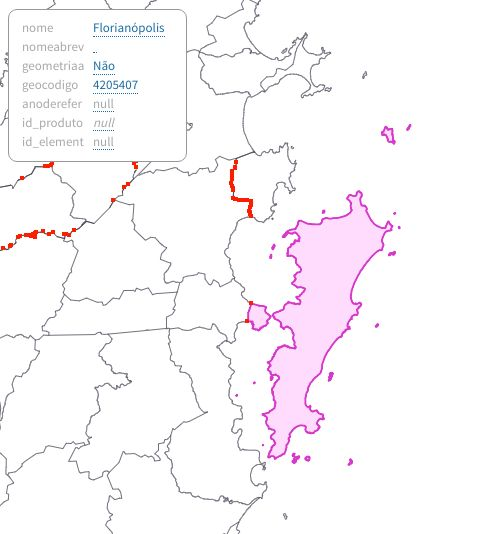

# Notas

Os arquivos resultantes são feitos com alta simplificação dos shapefiles base, que tem cerca de 100MB

Na simplificação, apliquei a exclusão de pequenas ilhas (excluindo até Fernando de Noronha). Isso permite uma auto-centralização do mapa conveniente pra maioria dos usos.

## Fontes

Pesquisando por shapefiles de municípios brasileiros com fonte do ibge, encontrei 3 possibilidades:

### 1 - A página  [Divisões Regionais do Brasil](https://www.ibge.gov.br/geociencias-novoportal/cartas-e-mapas/redes-geograficas/15778-divisoes-regionais-do-brasil.html?=&t=acesso-ao-produto)

Além dos shape files, contém também tabelas que relacionam codigo de município e regiões imediatas (rgi, antes conhecido como 'microrregiões') e regiões intermediárias (rgint, antes conhecido como 'mesorregiões') e UF. Essas informações também aparecem nos shapefiles:

Uma inconveniência que eu notei desse shapefile é que mostra os limites administrarivos, portanto Florianópolis não aparece com os limites da ilha, que é bem esquisito pra certas visualizações.

### 2 - O diretório de [malhas municipais no servidor ftp do ibge](ftp://geoftp.ibge.gov.br/organizacao_do_territorio/malhas_territoriais/malhas_municipais/municipio_2017/)

Esse ftp é o que contém nos links da página [malhas digitais do ibge](https://mapas.ibge.gov.br/bases-e-referenciais/bases-cartograficas/malhas-digitais)

Embora ai só liste até 2015, navegando o ftp tem até 2017

Esse é quase idêntico ao interior, uma diferença é que a única informação nos shapes é o código e o nome do município

### 3 - O arquivo 'Limites_v2017' no diretório de [base cartográficas contínuas](ftp://geoftp.ibge.gov.br/cartas_e_mapas/bases_cartograficas_continuas/bc250/versao2017/shapefile/) também no msm ftp

Eu só achei esse arquivo por estar listado na [página de mais baixados](https://downloads.ibge.gov.br/downloads_top.php).

Esse contém as características que eu prefiro:

Mas a única informação direto no shapefile é o código e nome de município. Por fim, decidi mergir esse shapefile com as informações da tabela de regiôes do primeiro link, os topojson resultantes são criados através da agregação das bordas por essas informações, ie, o regioes_intermediarias.topo.json na verdade é a dissolução das bordas dos municípios em municipios.topo.json de acordo com seu codigo_rgint
