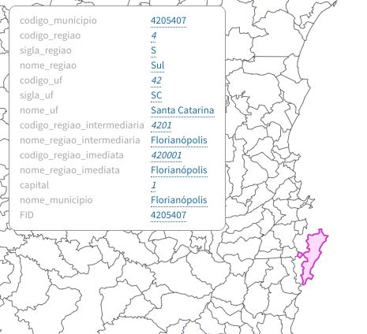
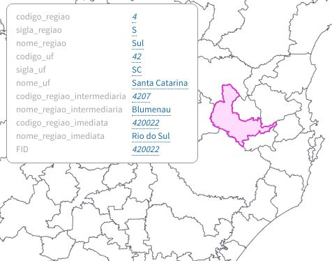
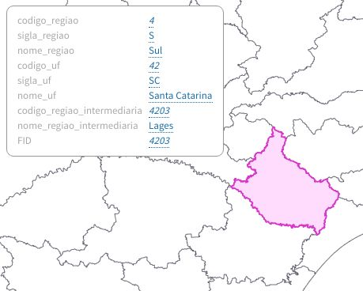
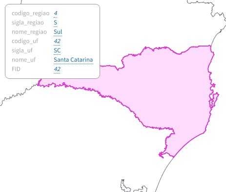
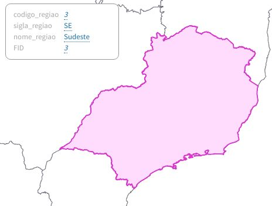

# Topojsons Brasil

Mapas e tabelas de municípios, regiões imediatas (antiga microrregiões), regiões intermediárias (antiga mesorregiões), ufs e regiões

## Mapas

### [municipios.topo.json](./municipios.topo.json)

Contém as bordas dos 5570 municípios, cada um com os campos de informações mostrados na imagem, dentro de `properties`. O seu campo de id corresponde ao código ibge do município

### [regioes_imediatas.topo.json](./regioes_imediatas.topo.json)

### [regioes_intermediarias.topo.json](./regioes_intermediarias.topo.json)

### [ufs.topo.json](./ufs.topo.json)

### [regioes.topo.json](./regioes.topo.json)

### [min/\*.topo.json](./min)

Cada um dos mapas acima tem seu correspondente em [min](./min), esses são idênticos, com excessão que não possuem `properties`, somente o campo de id, diminuindo bastante o tamanho. Use em conjunto com as tabelas de informações.

## Tabelas

### [municipios.csv](./municipios.csv), [municipios.json](./municipios.json), [municipios.xlsx](./municipios.xlsx)

Tabela com todas as informações dos municípios, pronta para o join com os mapas em [min](./min)

codigo_regiao|sigla_regiao|nome_regiao|codigo_uf|sigla_uf|nome_uf|codigo_regiao_intermediaria|nome_regiao_intermediaria|codigo_regiao_imediata|nome_regiao_imediata|codigo_municipio|capital|nome_municipio
---|---|---|---|---|---|---|---|---|---|---|---|---
4|S|Sul|42|SC|Santa Catarina|4201|Florianópolis|420001|Florianópolis|4217253|0|São Pedro de Alcântara
4|S|Sul|42|SC|Santa Catarina|4201|Florianópolis|420001|Florianópolis|4216602|0|São José
4|S|Sul|42|SC|Santa Catarina|4201|Florianópolis|420001|Florianópolis|4215901|0|São Bonifácio
4|S|Sul|42|SC|Santa Catarina|4201|Florianópolis|420001|Florianópolis|4215703|0|Santo Amaro da Imperatriz
4|S|Sul|42|SC|Santa Catarina|4201|Florianópolis|420001|Florianópolis|4214300|0|Rancho Queimado

## [min/\*](./min)

Separa os campos pra evitar redundância, diminuindo bastante o tamanho

### [min/municipios.csv](./min/municipios.csv), [min/municipios.json](./min/municipios.json), [min/municipios.xlsx](./min/municipios.xlsx)

codigo_municipio|capital|nome_municipio|codigo_regiao_imediata
---|---|---|---
1101104|0|Itapuã do Oeste|110001
1100809|0|Candeias do Jamari|110001
1100338|0|Nova Mamoré|110001
1100205|1|Porto Velho|110001
1100106|0|Guajará-Mirim|110001

### [min/regioes_imediatas.csv](./min/regioes_imediatas.csv), [min/regioes_imediatas.json](./min/regioes_imediatas.json), [min/regioes_imediatas.xlsx](./min/regioes_imediatas.xlsx)

codigo_regiao_imediata|nome_regiao_imediata|codigo_regiao_intermediaria
---|---|---
110001|Porto Velho|1101
110002|Ariquemes|1101
110003|Jaru|1101
110004|Ji-Paraná|1102
110005|Cacoal|1102

### [min/regioes_intermediarias.csv](./min/regioes_intermediarias.csv), [min/regioes_intermediarias.json](./min/regioes_intermediarias.json), [min/regioes_intermediarias.xlsx](./min/regioes_intermediarias.xlsx)

codigo_regiao_intermediaria|nome_regiao_intermediaria|codigo_uf
---|---|---
1101|Porto Velho|11
1102|Ji-Paraná|11
1201|Rio Branco|12
1202|Cruzeiro do Sul|12
1301|Manaus|13

### [min/ufs.csv](./min/ufs.csv), [min/ufs.json](./min/ufs.json), [min/ufs.xlsx](./min/ufs.xlsx)

codigo_uf|sigla_uf|nome_uf|codigo_regiao
---|---|---|---
11|RO|Rondônia|1
12|AC|Acre|1
13|AM|Amazonas|1
14|RR|Roraima|1
15|PA|Pará|1

### [min/regioes.csv](./min/regioes.csv), [min/regioes.json](./min/regioes.json), [min/regioes.xlsx](./min/regioes.xlsx)

codigo_regiao|sigla_regiao|nome_regiao
---|---|---
1|N|Norte
2|NE|Nordeste
3|SE|Sudeste
4|S|Sul
5|CO|Centro-Oeste

### Misc:

Para a maioria dos usos, você pode preferir usar a [excelente api oficial do ibge](https://servicodados.ibge.gov.br/api/docs) pra conseguir os dados desse repositório, eu preferi fazer o meu por conveniência dos meus usos, entre eles:
- A api ainda não usa `regiões imediatas e intermediárias` mas sim o antigo `micro e meso regiões`
- Os mapas tem uma simplificação esquisita, e o mapa-base tem bordas políticas, o que dá algumas incoveniências, como floripa não ser uma ilha
- Eu queria ter mapas com as informações já joinadas por conveniência

Veja mais detalhes sobre as fontes e extração em [Notas](./Notas.md)
